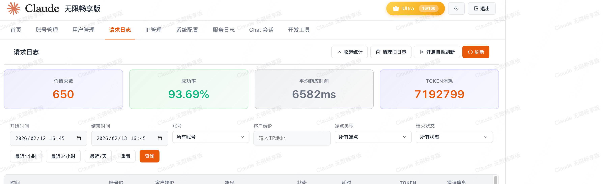
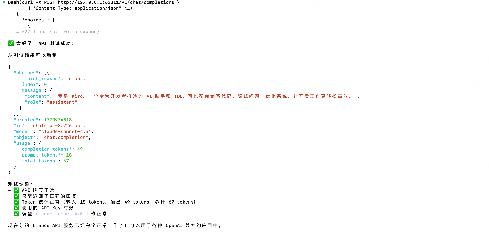
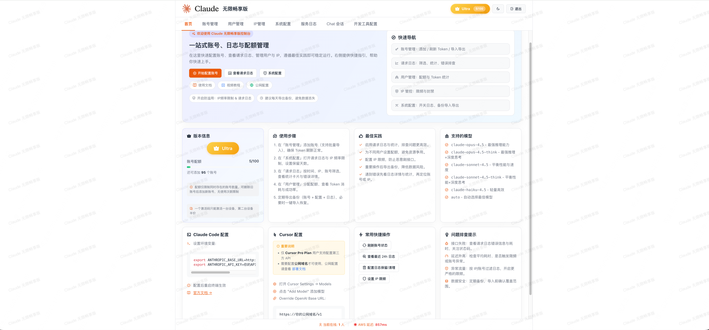
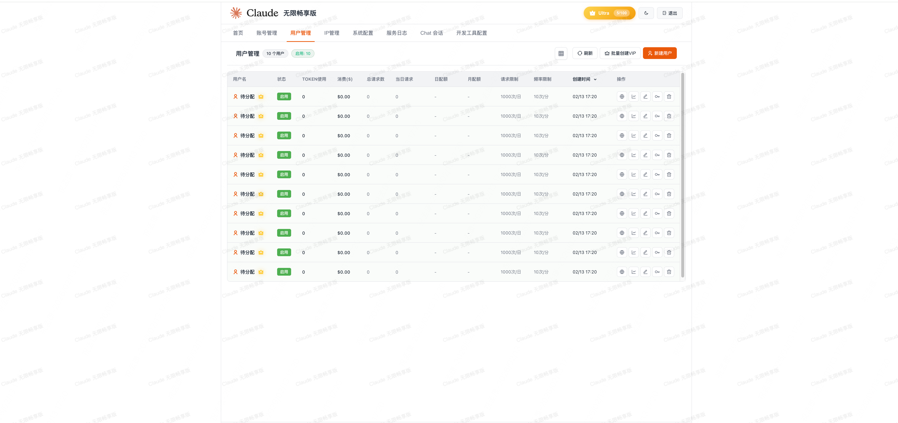
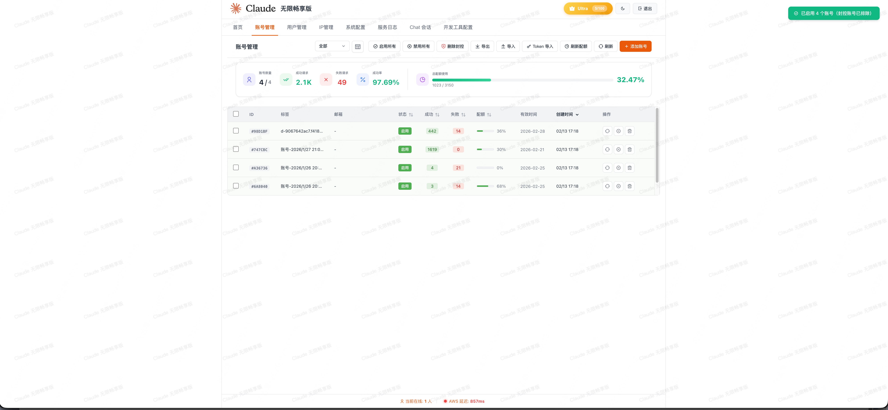

# Claude API 开源代理服务

[](https://golang.org)
[](LICENSE)

将 Amazon Q API 转换为 OpenAI 兼容格式的高性能 Go 代理服务。支持多账号管理、自动令牌刷新、流式响应、完整的 Web 管理控制台。

## 📸 界面预览

<div align="center">

### 控制台主界面


### 账号管理


### 聊天测试


### 系统设置


### 请求日志


</div>

## 📋 目录

- [核心特性](#核心特性)
- [快速开始](#快速开始)
- [编译构建](#编译构建)
- [部署指南](#部署指南)
- [使用示例](#使用示例)
- [配置说明](#配置说明)
- [API 文档](#api-文档)
- [技术架构](#技术架构)

## ✨ 核心特性

### 🔄 API 转换
- **OpenAI 兼容**: 完全兼容 OpenAI Chat Completions API
- **Claude 支持**: 支持 Claude Messages API 格式
- **流式响应**: SSE 流式输出
- **工具调用**: 完整支持 Function Calling / Tool Use
- **模型支持**: Claude 4.5 Opus、Sonnet 4.5、Sonnet 3.5

### 🔐 账号管理
- **OIDC 认证**: AWS OIDC 设备授权流程
- **多账号池**: 支持最多 100 个账号
- **自动刷新**: 后台自动刷新过期令牌
- **批量操作**: 批量添加、导入、导出账号

### 🖥️ 管理控制台
- **Web 界面**: Vue.js 驱动的现代化控制台
- **实时监控**: 账号状态、使用统计
- **在线测试**: 内置聊天测试界面
- **请求日志**: 完整的请求日志和统计

### 🛡️ 安全控制
- **IP 黑名单**: 封禁/解封特定 IP
- **频率限制**: 可配置的访问频率限制
- **API Key 认证**: 自定义 API Key
- **密码保护**: 管理控制台密码保护

## 🚀 快速开始

### 从源码编译

```bash
# 克隆仓库
git clone https://github.com/your-repo/claude-api.git
cd claude-api

# 安装依赖
go mod download

# 编译
go build -o claude-server main.go

# 运行
./claude-server
```

访问控制台：打开浏览器访问 `http://localhost:62311`，默认密码：`admin`

## 🔨 编译构建

### 构建脚本

项目提供了强大的 `build.sh` 脚本，支持多平台编译：

```bash
# 构建当前平台（server + desktop）
./build.sh

# 仅构建后端服务
./build.sh server

# 仅构建桌面应用（macOS + Windows）
./build.sh desktop

# 构建所有平台
./build.sh all

# 清理构建产物
./build.sh clean

# 指定版本构建
./build.sh server -v v1.2.0

# 指定平台构建
./build.sh server -p linux/amd64

# 构建选项
./build.sh --no-cache    # 禁用构建缓存
./build.sh --verbose     # 显示详细日志
./build.sh -h            # 显示帮助信息
```

### 支持的平台

**服务端**：
- Linux: amd64, arm64
- macOS: amd64, arm64
- Windows: amd64, arm64

**桌面应用**：
- macOS: Universal (需要 Wails v2)
- Windows: amd64 (需要 Wails v2)

### 构建产物

```
dist/
├── server/
│   ├── claude-server-linux-amd64.tar.gz
│   ├── claude-server-linux-arm64.tar.gz
│   ├── claude-server-darwin-amd64.tar.gz
│   ├── claude-server-darwin-arm64.tar.gz
│   ├── claude-server-windows-amd64.zip
│   └── claude-server-windows-arm64.zip
└── desktop/
    ├── Claude-API-Server-macOS.zip
    └── Claude-API-Server-Windows.zip
```

### 手动编译

```bash
# 当前平台
go build -o claude-server main.go

# 带版本号
go build -ldflags="-X main.Version=v1.0.0" -o claude-server main.go

# 跨平台编译
GOOS=linux GOARCH=amd64 go build -o claude-server-linux-amd64 main.go
GOOS=darwin GOARCH=arm64 go build -o claude-server-darwin-arm64 main.go
GOOS=windows GOARCH=amd64 go build -o claude-server-windows-amd64.exe main.go
```

## 📦 部署指南

### Linux Systemd 服务

创建服务文件 `/etc/systemd/system/claude-api.service`：

```ini
[Unit]
Description=Claude API Server
After=network.target

[Service]
Type=simple
User=www-data
WorkingDirectory=/opt/claude-api
ExecStart=/opt/claude-api/claude-server
Restart=on-failure
RestartSec=5s

# 环境变量（可选）
Environment="PORT=62311"

[Install]
WantedBy=multi-user.target
```

启动服务：

```bash
# 部署文件
sudo mkdir -p /opt/claude-api
sudo cp claude-server /opt/claude-api/
sudo chown -R www-data:www-data /opt/claude-api

# 启动服务
sudo systemctl daemon-reload
sudo systemctl enable claude-api
sudo systemctl start claude-api

# 查看状态
sudo systemctl status claude-api

# 查看日志
sudo journalctl -u claude-api -f
```

### Nginx 反向代理

```nginx
server {
    listen 80;
    server_name api.example.com;

    # 重定向到 HTTPS
    return 301 https://$server_name$request_uri;
}

server {
    listen 443 ssl http2;
    server_name api.example.com;

    # SSL 证书
    ssl_certificate /path/to/cert.pem;
    ssl_certificate_key /path/to/key.pem;

    # SSL 配置
    ssl_protocols TLSv1.2 TLSv1.3;
    ssl_ciphers HIGH:!aNULL:!MD5;

    location / {
        proxy_pass http://127.0.0.1:62311;
        proxy_http_version 1.1;

        # WebSocket 支持
        proxy_set_header Upgrade $http_upgrade;
        proxy_set_header Connection 'upgrade';

        # 代理头
        proxy_set_header Host $host;
        proxy_set_header X-Real-IP $remote_addr;
        proxy_set_header X-Forwarded-For $proxy_add_x_forwarded_for;
        proxy_set_header X-Forwarded-Proto $scheme;

        # 流式响应支持
        proxy_buffering off;
        proxy_cache_bypass $http_upgrade;
        proxy_read_timeout 300s;
        proxy_connect_timeout 75s;
    }
}
```

重载 Nginx：

```bash
sudo nginx -t
sudo systemctl reload nginx
```

### 进程管理器（PM2）

```bash
# 安装 PM2
npm install -g pm2

# 创建 ecosystem.config.js
cat > ecosystem.config.js << 'EOF'
module.exports = {
  apps: [{
    name: 'claude-api',
    script: './claude-server',
    cwd: '/opt/claude-api',
    instances: 1,
    autorestart: true,
    watch: false,
    max_memory_restart: '500M',
    env: {
      PORT: 62311
    }
  }]
}
EOF

# 启动
pm2 start ecosystem.config.js

# 查看状态
pm2 status

# 查看日志
pm2 logs claude-api

# 开机自启
pm2 startup
pm2 save
```

### 环境变量配置

支持的环境变量：

```bash
# 服务端口
export PORT=62311

# 数据目录（桌面应用）
export DATA_DIR=/path/to/data

# 禁用浏览器自动打开
export NO_BROWSER=true
```

### 数据备份

```bash
# 备份数据库
cp data.sqlite3 data.sqlite3.backup.$(date +%Y%m%d_%H%M%S)

# 定时备份（crontab）
0 2 * * * cd /opt/claude-api && cp data.sqlite3 backups/data.sqlite3.$(date +\%Y\%m\%d)

# 保留最近 7 天的备份
0 3 * * * find /opt/claude-api/backups -name "data.sqlite3.*" -mtime +7 -delete
```

## 💡 使用示例

### Python (OpenAI SDK)

```python
from openai import OpenAI

client = OpenAI(
    api_key="your-api-key",
    base_url="http://localhost:62311/v1"
)

# 普通对话
response = client.chat.completions.create(
    model="claude-sonnet-4.5",
    messages=[
        {"role": "user", "content": "你好"}
    ]
)
print(response.choices[0].message.content)

# 流式对话
stream = client.chat.completions.create(
    model="claude-sonnet-4.5",
    messages=[
        {"role": "user", "content": "写一首诗"}
    ],
    stream=True
)

for chunk in stream:
    if chunk.choices[0].delta.content:
        print(chunk.choices[0].delta.content, end="")
```

### Node.js (OpenAI SDK)

```javascript
import OpenAI from 'openai';

const client = new OpenAI({
  apiKey: 'your-api-key',
  baseURL: 'http://localhost:62311/v1'
});

// 普通对话
const response = await client.chat.completions.create({
  model: 'claude-sonnet-4.5',
  messages: [
    { role: 'user', content: '你好' }
  ]
});
console.log(response.choices[0].message.content);

// 流式对话
const stream = await client.chat.completions.create({
  model: 'claude-sonnet-4.5',
  messages: [
    { role: 'user', content: '写一首诗' }
  ],
  stream: true
});

for await (const chunk of stream) {
  if (chunk.choices[0]?.delta?.content) {
    process.stdout.write(chunk.choices[0].delta.content);
  }
}
```

### cURL

```bash
# 普通请求
curl -X POST http://localhost:62311/v1/chat/completions \
  -H "Content-Type: application/json" \
  -H "Authorization: Bearer your-api-key" \
  -d '{
    "model": "claude-sonnet-4.5",
    "messages": [
      {"role": "user", "content": "你好"}
    ]
  }'

# 流式请求
curl -X POST http://localhost:62311/v1/chat/completions \
  -H "Content-Type: application/json" \
  -H "Authorization: Bearer your-api-key" \
  -d '{
    "model": "claude-sonnet-4.5",
    "messages": [
      {"role": "user", "content": "你好"}
    ],
    "stream": true
  }'
```

## ⚙️ 配置说明

### config.yaml

```yaml
database:
  type: sqlite  # 或 mysql
  sqlite:
    path: data.sqlite3
  mysql:
    host: localhost
    port: 3306
    user: root
    password: ""
    database: claude-api
    charset: utf8mb4

server:
  host: 0.0.0.0
  port: 62311

debug: false
test: false
```

### 系统设置（存储在数据库）

| 设置项 | 说明 | 默认值 |
|--------|------|--------|
| `apiKey` | OpenAI API Key | 空 |
| `adminPassword` | 管理员密码 | `admin` |
| `debugLog` | 调试日志 | `false` |
| `enableRequestLog` | 请求日志 | `true` |
| `logRetentionDays` | 日志保留天数 | `30` |
| `enableIPRateLimit` | IP 频率限制 | `false` |
| `ipRateLimitWindow` | 限制时间窗口（分钟） | `1` |
| `ipRateLimitMax` | 窗口内最大请求数 | `100` |

## 📡 API 文档

### OpenAI 兼容端点

```bash
POST /v1/chat/completions
Content-Type: application/json
Authorization: Bearer YOUR_API_KEY

{
  "model": "claude-sonnet-4.5",
  "messages": [
    {"role": "user", "content": "你好"}
  ],
  "stream": true
}
```

**支持的模型**：
- `claude-4.5-opus-high` - Claude 4.5 Opus (高性能)
- `claude-4.5-opus-low` - Claude 4.5 Opus (低成本)
- `claude-sonnet-4.5` - Claude Sonnet 4.5
- `claude-sonnet-3.5` - Claude Sonnet 3.5

### 管理端点

```bash
# 账号管理
GET    /v2/accounts              # 列出账号
POST   /v2/accounts              # 创建账号
POST   /v2/accounts/feed         # 批量添加
POST   /v2/accounts/import       # 导入账号
GET    /v2/accounts/export       # 导出账号
DELETE /v2/accounts/:id          # 删除账号

# 设置管理
GET    /v2/settings              # 获取设置
PUT    /v2/settings              # 更新设置

# 日志管理
GET    /v2/logs                  # 获取日志
GET    /v2/logs/stats            # 统计数据
POST   /v2/logs/cleanup          # 清理日志

# IP 管理
GET    /v2/ips/blocked           # 被封禁的 IP
POST   /v2/ips/block             # 封禁 IP
POST   /v2/ips/unblock           # 解封 IP
```

## 🏗️ 项目结构

```
claude-api/
├── main.go                      # 程序入口，HTTP 服务器启动
├── build.sh                     # 多平台构建脚本
├── config.yaml                  # 配置文件（可选）
├── internal/                    # 内部包
│   ├── api/                    # API 服务器
│   │   ├── server.go           # 服务器核心、中间件、缓存
│   │   ├── routes.go           # 路由配置
│   │   ├── handlers.go         # 请求处理器（主要逻辑）
│   │   └── cache.go            # 账号池、设置缓存
│   ├── amazonq/                # Amazon Q 客户端
│   │   ├── client.go           # HTTP 客户端
│   │   ├── parser.go           # 响应解析
│   │   └── errors.go           # 错误处理
│   ├── auth/                   # 认证模块
│   │   ├── oidc.go             # OIDC 设备授权流程
│   │   ├── kiro.go             # Kiro 社交登录
│   │   └── apikey.go           # API Key 验证
│   ├── claude/                 # 格式转换
│   │   └── converter.go        # OpenAI ↔ Amazon Q 格式转换
│   ├── stream/                 # 流处理
│   │   ├── parser.go           # SSE 流解析
│   │   ├── openai_sse.go       # OpenAI 格式流
│   │   ├── claude_sse.go       # Claude 格式流
│   │   └── unified_sse.go      # 统一流处理
│   ├── database/               # 数据库
│   │   ├── database.go         # 数据库初始化
│   │   ├── accounts.go         # 账号管理
│   │   ├── users.go            # 用户管理
│   │   ├── settings.go         # 系统设置
│   │   ├── logs.go             # 请求日志
│   │   ├── proxy.go            # 代理管理
│   │   └── blocked_ips.go      # IP 黑名单
│   ├── models/                 # 数据模型
│   │   ├── account.go          # 账号模型
│   │   ├── user.go             # 用户模型
│   │   ├── settings.go         # 设置模型
│   │   ├── openai.go           # OpenAI 格式
│   │   ├── claude.go           # Claude 格式
│   │   └── amazonq.go          # Amazon Q 格式
│   ├── config/                 # 配置管理
│   ├── logger/                 # 日志系统
│   ├── tokenizer/              # Token 计数
│   ├── compressor/             # 上下文压缩器
│   ├── proxy/                  # 代理池管理
│   ├── ratelimit/              # 双重限流器（IP + API Key）
│   └── utils/                  # 工具函数
├── frontend/                    # Web 前端
│   ├── index.html              # 主页面
│   ├── login.html              # 登录页面
│   ├── js/                     # JavaScript 模块
│   │   ├── app.js              # 主应用入口
│   │   ├── accounts.js         # 账号管理
│   │   ├── users.js            # 用户管理
│   │   ├── settings.js         # 系统设置
│   │   ├── chat.js             # 聊天界面
│   │   ├── logs.js             # 请求日志
│   │   ├── ips.js              # IP 管理
│   │   └── api.js              # API 封装
│   ├── css/                    # 样式文件
│   └── vendor/                 # 第三方库（Vue.js、Marked 等）
├── scripts/                     # 辅助脚本
│   ├── start.sh                # 启动脚本
│   ├── stop.sh                 # 停止脚本
│   └── setup.sh                # 环境配置
└── dist/                        # 编译产物（自动生成）
    └── server/                 # 各平台服务端程序
```

## 🏗️ 技术架构

### 技术栈

- **后端**: Go 1.24+, Gin
- **数据库**: SQLite (glebarez/sqlite - 纯 Go，无需 CGO) / MySQL
- **前端**: Vue.js 3
- **Token 计数**: anthropic-tokenizer-go

### 项目结构

```
claude-api/
├── main.go                      # 程序入口
├── build.sh                     # 构建脚本
├── config.yaml                  # 配置文件
├── internal/                    # 内部包
│   ├── api/                    # API 服务器
│   │   ├── server.go           # 服务器核心
│   │   ├── routes.go           # 路由配置
│   │   └── handlers.go         # 请求处理器
│   ├── amazonq/                # Amazon Q 客户端
│   ├── auth/                   # 认证模块
│   ├── claude/                 # 格式转换
│   ├── stream/                 # 流处理
│   ├── database/               # 数据库
│   ├── models/                 # 数据模型
│   ├── config/                 # 配置管理
│   ├── logger/                 # 日志系统
│   ├── tokenizer/              # Token 计数
│   └── sync/                   # 同步客户端
├── frontend/                    # Web 前端
│   ├── index.html
│   ├── js/
│   └── css/
│   ├── server.py
│   └── requirements.txt
└── dist/                        # 编译产物
```

### 数据流

```
客户端 → Gin Router → 认证中间件 → 账号选择器 → 格式转换器 → Amazon Q API
                                                              ↓
客户端 ← OpenAI 格式 ← 流解析器 ← SSE 流 ← Amazon Q 响应
```

## 🐛 故障排查

### 常见问题

**1. 令牌刷新失败**
```
错误: failed to refresh token
解决: 检查 refreshToken 是否有效，尝试重新授权
```

**2. 连接超时**
```
错误: context deadline exceeded
解决: 检查网络连接，考虑配置 HTTP_PROXY
```

**3. 数据库锁定**
```
错误: database is locked
解决: 确保没有其他进程使用数据库，或重启服务器
```

### 健康检查

```bash
curl http://localhost:62311/healthz
# 预期响应: {"status":"ok"}
```

### 日志位置

- **控制台日志**: 直接输出到终端
- **请求日志**: 存储在数据库 `request_logs` 表
- **调试日志**: 启用调试模式后在控制台输出

## 🔒 安全建议

1. **修改默认密码**: 首次启动后立即修改管理员密码
2. **使用 HTTPS**: 生产环境使用 Nginx 反向代理并配置 SSL
3. **限制访问**: 使用防火墙限制管理控制台访问
4. **定期备份**: 定期备份 `data.sqlite3` 数据库
5. **监控日志**: 定期查看请求日志，发现异常及时处理

## 📄 许可证

MIT License

---

**⚠️ 免责声明**: 本项目仅供学习和研究使用，请遵守 AWS 服务条款和相关法律法规。
